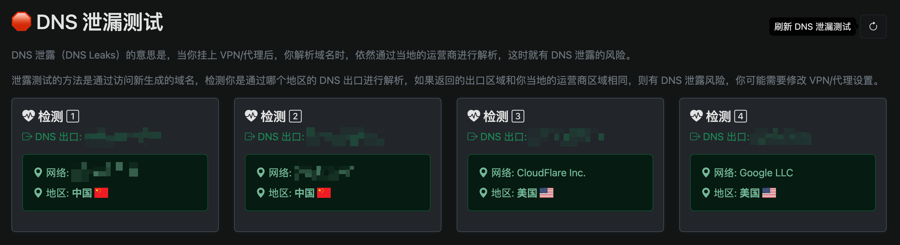
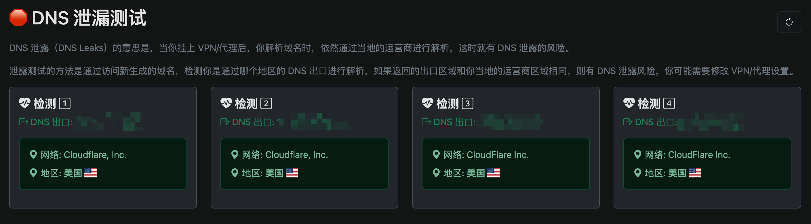

# GateShift


[](https://codecov.io/gh/ourines/GateShift)

A cross-platform gateway switching tool designed for OpenWrt bypass routers, allowing seamless traffic path switching between default and proxy gateways.

English | [简体中文](./README.md)

## Background

In network environments using OpenWrt as a bypass router, users often need to switch between the default gateway and the OpenWrt bypass router gateway to meet different internet access needs. This process typically requires manual network setting modifications, which is cumbersome and error-prone. GateShift was created to solve this problem, offering a simple command-line tool that enables one-click gateway switching, greatly simplifying network management.

## Core Features

- **Seamless Gateway Switching**: Switch between main router and OpenWrt bypass router gateways with a single command
- **DNS Leak Protection**: Built-in DNS proxy feature ensures all DNS requests go through the proxy gateway
- **Daemon Mode**: Run as a background daemon for continuous and stable service
- **Cross-Platform Support**: Compatible with macOS, Linux, and Windows systems
- **Configuration Persistence**: Automatically remembers your gateway configurations
- **Permission Management**: Built-in sudo session management to avoid repeated password entry
- **Real-time Status Detection**: Provides current network status and internet connectivity checks
- **System-wide Installation**: Supports global installation for command access from anywhere

## Installation

### Method 1: Using Go Install (Recommended)

If you have Go 1.18 or later installed:

```bash
go install github.com/ourines/GateShift/cmd/gateshift@latest
```

### Method 2: Using the Quick Install Script

```bash
curl -sSL https://raw.githubusercontent.com/ourines/GateShift/main/install.sh | bash
```

### Method 3: Using the Install Command

If you've already built or downloaded the binary, you can install it system-wide with:

```bash
gateshift install
```

This will install the GateShift tool to your system so it can be called from anywhere in your terminal. This command requires administrator privileges.

To uninstall:

```bash
gateshift uninstall
```

### Method 4: From Source

1. Clone this repository
2. Build the application:

```bash
make build
```

3. Install it to your local bin directory:

```bash
make install
```

### Method 5: Prebuilt Binaries

Download the latest prebuilt binary for your platform from the [Releases page](https://github.com/ourines/GateShift/releases).

## Usage

```bash
# Switch to bypass router gateway (e.g., OpenWrt)
gateshift proxy

# Switch back to default gateway (e.g., main router)
gateshift default

# Show current network status
gateshift status

# Configure gateways
gateshift config set-proxy 192.168.31.100  # Set OpenWrt bypass router IP
gateshift config set-default 192.168.31.1  # Set main router IP
gateshift config show

# Install system-wide
gateshift install

# Uninstall from system
gateshift uninstall

# DNS features
gateshift dns enable                          # Enable DNS proxy
gateshift dns disable                         # Disable DNS proxy
gateshift dns set-port 5353                   # Set DNS listening port
gateshift dns set-address 127.0.0.1           # Set DNS listening address
gateshift dns set-upstream 1.1.1.1 8.8.8.8 9.9.9.9  # Set upstream DNS servers
gateshift dns show                            # Show DNS configuration
gateshift dns start                           # Start DNS service
gateshift dns start -f                        # Start DNS service in foreground
gateshift dns restart                         # Restart DNS service
gateshift dns stop                            # Stop the running DNS service
gateshift dns logs                            # View DNS logs
gateshift dns logs -f                         # View DNS logs in real-time
gateshift dns logs -n 100                     # View last 100 lines of DNS logs
gateshift dns logs -F "google.com"            # Filter logs containing google.com

# Daemon mode
gateshift daemon -d                           # Run in daemon mode
```

## Configuration

The application stores its configuration in `~/.gateshift/config.yaml`. You can edit this file manually or use the `config` commands.

Default configuration:

```yaml
proxy_gateway: 192.168.31.100  # OpenWrt bypass router IP
default_gateway: 192.168.31.1  # Main router IP
dns:
  enabled: false               # Whether DNS proxy is enabled
  listen_addr: 127.0.0.1       # DNS listening address
  listen_port: 53              # DNS listening port
  upstream_dns:                # Upstream DNS server list
    - 1.1.1.1:53
    - 8.8.8.8:53
    - 9.9.9.9:53
```

## Detailed DNS Features

GateShift includes a powerful DNS proxy functionality, primarily designed to prevent DNS leaks and provide more reliable DNS resolution services.

### DNS Leak Protection

When using proxy networks, DNS requests can sometimes bypass the proxy and go directly to your ISP's DNS servers, revealing your actual browsing activity. GateShift's DNS proxy feature prevents this by routing all DNS queries through the proxy network.

#### Before


#### After


### DNS Service Running Modes

GateShift offers three DNS service running modes to accommodate different scenarios:

1. **Standard Mode**: `sudo gateshift dns start` - Starts the DNS service and exits
2. **Foreground Mode**: `sudo gateshift dns start -f` - Starts DNS service and keeps running in the foreground
3. **Daemon Mode**: `sudo gateshift daemon -d` - Runs as a background daemon

Note: DNS services typically require administrator/root privileges as they need to:
- Bind to privileged ports (port 53 is below 1024)
- Modify system DNS settings

### DNS Configuration Management

```bash
# Enable/disable DNS proxy (only modifies configuration, doesn't start/stop service)
gateshift dns enable
gateshift dns disable

# Set DNS listening address and port
gateshift dns set-address 127.0.0.1  # Default listens on localhost
gateshift dns set-port 53            # Default uses port 53

# If you encounter port 53 permission issues, you can set a higher port number
gateshift dns set-port 10053         # Use a non-privileged port

# Configure upstream DNS servers (multiple can be set)
gateshift dns set-upstream 1.1.1.1 8.8.8.8 9.9.9.9
# System will automatically add ":53" port suffix

# View current DNS configuration and running status
gateshift dns show
```

### DNS Service Management

```bash
# Start DNS service
sudo gateshift dns start          # Start background service
sudo gateshift dns start -f       # Run in foreground (press Ctrl+C to stop)

# Stop DNS service
sudo gateshift dns stop

# Restart DNS service (apply new configuration)
sudo gateshift dns restart
```

### DNS Log Viewing and Analysis

GateShift provides powerful DNS log viewing capabilities to help you monitor DNS activity:

```bash
# Basic log viewing (default shows last 50 lines)
gateshift dns logs

# Real-time log viewing (similar to tail -f)
gateshift dns logs -f

# Custom line count
gateshift dns logs -n 200         # View last 200 lines

# Filter logs by keywords (case-insensitive)
gateshift dns logs -F "google"    # View logs containing "google"
gateshift dns logs -F "error"     # View only error messages
gateshift dns logs -F "query"     # View only query requests

# Combined usage
gateshift dns logs -F "baidu" -n 10 -f  # Real-time view of the latest 10 lines containing "baidu"
```

## Typical Use Cases

- **Regular/Proxy Internet Switching**: Quickly switch between regular internet access and proxy-based access
- **DNS Leak Prevention**: Ensure all DNS requests go through the proxy gateway, preventing IP leaks
- **Multiple Network Environments**: Flexibly transition between different network proxy strategies
- **Application-specific Networking**: Provide convenient gateway management for applications requiring specific network environments
- **Network Testing**: Test connection quality and speed across different network paths
- **Home/Office Network Management**: Manage multiple network schemes

## Building for Different Platforms

To build for all supported platforms:

```bash
make build-all
```

This will create binaries for:
- Linux (amd64, arm64)
- macOS (amd64, arm64)
- Windows (amd64)

The binaries will be placed in the `bin/` directory.

## License

This project is licensed under the MIT License - see the [LICENSE](LICENSE) file for details.